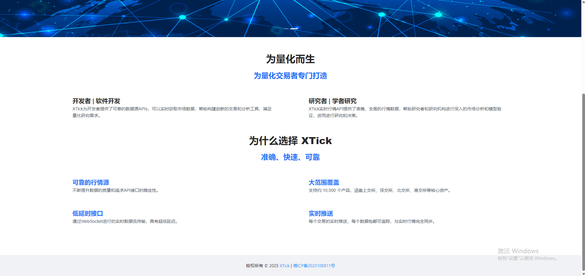

# XTick

  

   XTick提供实时行情报价数据接入解决方案。

## 项目介绍

XTick行情API提供了全面、准确、稳定的行情数据，帮助开发者和研究者构建创新的交易和分析工具，满足金融行业的需求，进行深入的市场分析和模型验证。
 您的支持，是我们继续维护好XTick项目的动力。 
XTick官网：http://www.xtick.top  

  

## API接口文档

API接口分为订阅数据、行情数据、财务数据、金融指标数据四个部分。行情数据支持盘中实时更新。  
除了订阅接口是Websocket API，其余接口为Http API接口且均支持GET和POST方法，下面以GET请求示例。  

2.1 订阅数据接口  
在GitHub上，已实现Java版本和Python版本的订阅代码，请先下载代码直接调用。  
GitHub代码下载地址：  
https://github.com/xticktop/xtick  

订阅数据按照证券交易所订阅推送，包括上交所、深交所、北交所、港交所（只支持部分股票）。  
数据为实时推送，发数据非常快，客户端接受到数据后，最好做异步处理，将接受数据和数据处理分开，避免接受数据阻塞。切记...切记...切记：数据接受和数据处理，务必放在两个线程中，不要阻塞数据接受。

2.1.1 订阅接口  
订阅数据：订阅为Websocket API，请在Github上下载开源项目，参考XTickWebSocketClient.java中已实现的订阅功能。  
入参1：authCodes 枚举取值如下：  
场景a、按交易所订阅：  
- tick.SZ.1 - 订阅深交所A股的tick数据。
- tick.SZ.10 - 订阅深交所指数的tick数据。
- tick.SZ.20 - 订阅深交所ETF的tick数据。
- tick.SH.1 - 订阅上交所A股的tick数据。
- tick.SH.10 - 订阅上交所指数的tick数据。
- tick.SH.20 - 订阅上交所ETF的tick数据。
- tick.BJ.1 - 订阅北交所ETF的tick数据。
- tick.HK.3 - 订阅港交所ETF的tick数据。
- time.SZ.1 - 订阅深交所A股的k线数据，包括1m。
- time.SH.1 - 订阅上交所A股的k线数据，包括1m。
- time.BJ.1 - 订阅北交所A股的k线数据，包括1m。
- time.HK.3 - 订阅港交所港股的k线数据，包括1m。

  场景b、按个股订阅
- 000001.SZ - 订阅深交所平安银行000001的tick数据。支持按股票个数订阅，包括沪深京港四个交易所的股票，最多订阅50个。
  入参2：token 登录XTick网站，注册获取

2.1.2 查询订阅
1. 请求方法：
   http://api.xtick.top/doc/unsubscribe?token=043fbdcba7f3f3ab332ffff123456789
   入参1：token 登录XTick网站，注册获取

2.1.3 取消订阅
1. 请求方法：
   http://api.xtick.top/doc/querysubscribe?token=043fbdcba7f3f3ab332ffff123456789
   入参1：token 登录XTick网站，注册获取

2.2 行情数据接口

在GitHub上，已实现Java版本和Python版本的代码，请先下载代码直接调用。  

1. 请求方法：
   请求地址：http://api.xtick.top/doc/market?type=1&code=000001&period=1d&fq=none&startDate=2025-03-25&endDate=2025-03-25&token=043fbdcba7f3f3ab332ffff123456789
   备注：行情数据支持交易日内盘内实时更新，如有需要其他K线数据，比如三分钟k线或者2小时K线等，可联系作者。 
   入参1：type 股票类别  
   沪深京A股type=1，港股type=3，沪深指数type=10，沪深ETF type=20; 
   入参2：code 股票代码  
   比如平安银行为000001  
   入参3：period 用于表示要获取的周期，枚举取值如下：  
- 1m - 1分钟线
- 5m - 5分钟线
- 15m - 15分钟线
- 30m - 30分钟线
- 1h - 1小时线
- 1d - 日线
- 1w - 周线
- 1mon - 月线
- 1q - 季度线
- 1hy - 半年线
- 1y - 年线
  参数4：fq 除权方式，用于K线数据复权计算，枚举取值如下：  
- none 不复权
- front 前复权
- back 后复权
- front_ratio 等比前复权
- back_ratio 等比后复权
   参数5：时间范围，用于指定数据请求范围，表示的范围是[startDate , endDate]区间（包含前后边界）。  
  特别说明：  
  period为分钟类型（包括1m、5m、15m、30m、1h），则单次请求时间跨度最大为一月，即endDate - startDate不超过30天。
  如果需要获取盘中实时行情数据，endDate参数填写当天交易日日期即可。
- startDate - 起始时间，日期格式：2025-03-25
- endDate- 结束时间，日期格式：2025-03-25

  历史数据说明：  
  分钟级别数据：2024年4月-至今  
  日线级别数据：公司上市-至今  

  入参6：token 登录XTick网站，注册获取 
  注意：如果需要盘后获取当天全市场股票日线数据，将code设置为all，startDate和endDate日期设置为当前交易日，调用接口接口。

2.3 财务数据接口  

在GitHub上，已实现Java版本和Python版本的代码，请先下载代码直接调用。  

1. 请求方法：
   请求地址：http://api.xtick.top/doc/financial?type=1&code=000001&report=Pershareindex&startDate=2020-03-25&endDate=2025-03-25&token=043fbdcba7f3f3ab332ffff123456789
   入参1：type 股票类别 
   沪深京A股type=1，港股type=3; 
   入参2：code 股票代码 
   比如平安银行为000001 

   入参3：report 用于表示要获取的财务报表，枚举取值如下：  
- Balance - 资产负债表，数据范围：公司上市-至今
- Income - 利润表，数据范围：公司上市-至今
- CashFlow - 现金流量表，数据范围：1997年-至今
- Capital - 股本表，数据范围：公司上市-至今
- Holdernum - 股东数，数据范围：2001年-至今
- Top10holder - 十大股东，数据范围：公司上市-至今
- Top10flowholder - 十大流通股东，数据范围：2004年-至今
- Pershareindex - 每股指标，数据范围：2007年-至今 
  参数4：时间范围，用于指定数据请求范围，表示的范围是[startDate , endDate]区间（包含前后边界）。 
- startDate - 起始时间，日期格式：2025-03-25
- endDate- 结束时间，日期格式：2025-04-25  
  入参5：token 登录XTick网站，注册获取  

2.4 金融指标接口

1、金融指标API接口文档 
所有指标接口的清单，请点击访问：金融指标API文档    http://www.xtick.top/indicator  

2、通用参数
如以下参数，请参考行情数据接口中的定义。 

- type：股票类别。
- code：股票代码。
- period：k线周期。
- fq：除权方式。
- startDate：起始时间。
- endDate：结束时间。
- token：令牌
  3、扩展参数 
  参数名：scale 
  默认值为3，取值范围[1-10]，取值含义：数值代表返回值的精度（保留几位小数位）。 
  参数名：round 
  默认值为1，取值范围[0-7]，取值含义： 
-   0 ROUND_UP模式，四舍五入
-   1 ROUND_DOWN模式，截断
-   2 ROUND_CEILING模式
-   3 ROUND_FLOOR模式
-   4 ROUND_HALF_UP模式
-   5 ROUND_HALF_DOWN模式
-   6 ROUND_HALF_EVEN模式
-   7 ROUND_UNNECESSARY模式
  可参考说明 BigDecimal精确的数值计算

  4、金融指标验证  
  尽最大可能，将尽可能多的金融指标数据进行验证，也欢迎大家参与验证。  
1. 量化指标之KDJ公式验证-CSDN博客  
2. 量化指标之MACD公式验证-CSDN博客  

2.5 盯盘数据接口
2.5.1 竞价数据-实时接口  
获取沪深京股票交易日盘中实时竞价数据，竞价时间段：9:15-9:25。每次调用接口返回最新竞价数据。  

1. 请求方法：  
   请求地址：http://api.xtick.top/doc/bid/time?type=1&code=000001&token=043fbdcba7f3f3ab332ffff123456789
   入参1：type 股票类别  
   这里目前只支持沪深京A股的竞价数据，type设置为1。  
   入参2：code 股票代码  
   比如平安银行为000001。  
   这里支持批量参数  
   a、code取值为000001，表示获取股票000001的竞价数据。  
   b、code取值为000001,000002,600000，表示获取这三个票的竞价数据，多个票直接用英文逗号分割，最多50个股票。  
   a、code取值为all，表示获取全市场股票的竞价数据。  
   入参3：token 登录XTick网站，注册获取。  
   入参4：option 可选参数，为json字符串。如果不需要过滤和排序功能，可以忽略该参数  
   String filter; //定义筛选条件  
   String sort; //定义排序字段  
   int asc; //定义排序方式 0:降序 1:升序  
   int limit = 10000;//定义截取长度  
   比如常见的两种场景：  
   场景一：当天全市场股票竞价，按未成交额排序，从大到小，取前100条。  
   {"sort":"noe","asc":0,"limit":100}  
   场景二：当天全市场股票竞价，过滤出来当天竞价涨幅5个点以上且竞价额大于等于1000万的个股，结果数据按未成交额排序，从大到小，取前100条。  
   {"filter":"jjzf>5;jje>=10000000","sort":"noe","asc":0,"limit":100}  

2.5.2 竞价数据-历史接口

1. 请求方法：  
   请求地址：http://api.xtick.top/doc/bid/history?type=1&code=000001&startDate=2025-03-25&endDate=2026-03-25&token=043fbdcba7f3f3ab332ffff123456789
    入参1：type 股票类别  
   这里目前只支持沪深京A股的竞价数据，type设置为1。  
   入参2：code 股票代码  
   比如平安银行为000001  
   这里支持以下批量参数  
   a、code取值为000001，表示获取股票000001的竞价数据。注意这里不支持多个股票  
   b、code取值为all，startDate和endDate必须是同一天，表示获取某个交易日内的全市场股票的竞价数据。  
     参数3：时间范围，用于指定数据请求范围，表示的范围是[startDate , endDate]区间（包含前后边界）。、竞价历史数据范围：2025年11月-至今
   特别说明：  

- startDate - 起始时间，日期格式：2025-03-25  
- endDate- 结束时间，日期格式：2025-03-25  
  入参4：token 登录XTick网站，注册获取  

2.5.3 竞价数据-详情接口

1. 请求方法：  
   请求地址：http://api.xtick.top/doc/bid/detail?type=1&code=000001&tradeDate=2025-03-25&token=043fbdcba7f3f3ab332ffff123456789
    入参1：type 股票类别  
   这里目前只支持沪深京A股的竞价数据，type设置为1。  
   入参2：code 股票代码  
   比如平安银行为000001，不支持批量参数。  
   参数3：tradeDate 交易日期，日期格式：2025-10-28。  
   竞价详细历史数据范围：2025年4月-至今，只能通过接口调用最近半年数据。  
   入参4：token 登录XTick网站，注册获取  

2.5.4 Tick数据-实时接口

1. 请求方法：  
   请求地址：http://api.xtick.top/doc/tick/time?type=1&code=000001&period=tick&token=043fbdcba7f3f3ab332ffff123456789
    入参1：type 股票类别  
   这里目前只支持沪深京A股的Tick数据，type设置为1。  
   入参2：code 股票代码  
   比如平安银行为000001。  
   这里支持批量参数  
   a、code取值为000001，表示获取股票000001的竞价数据。  
   b、code取值为000001,000002,600000，表示获取这三个票的竞价数据，多个票直接用英文逗号分割，最多50个股票。  
   a、code取值为all，表示获取全市场股票的竞价数据。  
  入参3：period 用于表示要获取的周期，枚举取值如下：  
- tick - tick数据  
- 1d - 日线数据  
  入参4：token 登录XTick网站，注册获取  

2.5.5 Tick数据-历史接口

1. 请求方法：  
   请求地址：http://api.xtick.top/doc/tick/history?type=1&code=000001&tradeDate=2025-10-25&token=043fbdcba7f3f3ab332ffff123456789
    入参1：type 股票类别  
   这里目前只支持沪深京A股的竞价数据，type设置为1。  
   入参2：code 股票代码  
   比如平安银行为000001，不支持批量参数。  
   参数3：tradeDate 交易日期，日期格式：2025-10-28。  
   Tick历史数据范围：2025年2月-至今，只能通过接口调用最近半年数据。  
   入参4：token 登录XTick网站，注册获取  

2.6 其它接口 

2.6.1 股票列表  

获取所有股票代码，包括沪深京A股、港股、沪深指数、ETF几类数据。  

1. 请求方法：  
   请求地址：http://api.xtick.top/doc/codes?token=043fbdcba7f3f3ab332ffff123456789  
   备注：返回数据实例 1-000001 代表 type-code  
   沪深京A股type=1，港股type=3，沪深指数type=10，沪深ETF type=20;  

   入参1：token 登录XTick网站，注册获取。  

## 项目地址

目前项目托管在 Gitee 和 Github 平台上中，欢迎大家 Star 和 Fork 支持~  

### Java SDK :

Gitee地址：https://github.com/xticktop/xtick  
Github地址：https://github.com/xticktop/xtick  

## 关注&交流

为了方便小伙伴们沟通交流，创建了QQ群 (加群备注：XTick)
，目前项目还存在很多不足之处，欢迎各位大佬进群进行交流，为了防止广告进入，希望加群的时候能添加备注，谢谢~ 
如遇问题联系作者，邮箱：xticktop@163.com  
[网站说明文档](https://ccn9lag3l54q.feishu.cn/wiki/ABenwEvDOiShYrkaLAJcFY5gnZf) 

| QQ群【推荐】                                                                                  |
|------------------------------------------------------------------------------------------|
|  |

